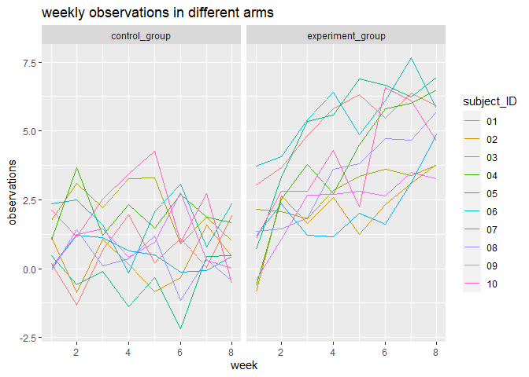

p8105\_hw5\_hz2770
================
Hao Zheng
11/16/2021

``` r
library(tidyverse)
```

    ## -- Attaching packages --------------------------------------- tidyverse 1.3.1 --

    ## v ggplot2 3.3.5     v purrr   0.3.4
    ## v tibble  3.1.4     v dplyr   1.0.7
    ## v tidyr   1.1.3     v stringr 1.4.0
    ## v readr   2.0.1     v forcats 0.5.1

    ## -- Conflicts ------------------------------------------ tidyverse_conflicts() --
    ## x dplyr::filter() masks stats::filter()
    ## x dplyr::lag()    masks stats::lag()

``` r
# read the csv
homicide_data = read.csv("./data/homicide_data.csv", na = c(" ", "Unknown"))
```

## Problem 1

The dataset contains 52179 homicide cases and 12 variables including the
date, victim’s demographic information, city, state, precise longitude
and latitude, and disposition status.

Then we create a new variable called `city_state`, and show the number
of all homicides and unsolved homicides in each `city_state`.

``` r
homicide_data = 
  homicide_data %>% 
  mutate(city_state = str_c(city, ", ", state)) %>% 
  relocate(city_state) %>% 
  filter(city_state != "Tulsa, AL")


summary_data = 
  homicide_data %>% 
  group_by(city_state) %>% 
  summarise(
    total_homicides = n(),
    unsolved_homicides = sum(disposition %in% c("Closed without arrest", "Open/No arrest"))
  )

knitr::kable(summary_data)
```

| city\_state        | total\_homicides | unsolved\_homicides |
|:-------------------|-----------------:|--------------------:|
| Albuquerque, NM    |              378 |                 146 |
| Atlanta, GA        |              973 |                 373 |
| Baltimore, MD      |             2827 |                1825 |
| Baton Rouge, LA    |              424 |                 196 |
| Birmingham, AL     |              800 |                 347 |
| Boston, MA         |              614 |                 310 |
| Buffalo, NY        |              521 |                 319 |
| Charlotte, NC      |              687 |                 206 |
| Chicago, IL        |             5535 |                4073 |
| Cincinnati, OH     |              694 |                 309 |
| Columbus, OH       |             1084 |                 575 |
| Dallas, TX         |             1567 |                 754 |
| Denver, CO         |              312 |                 169 |
| Detroit, MI        |             2519 |                1482 |
| Durham, NC         |              276 |                 101 |
| Fort Worth, TX     |              549 |                 255 |
| Fresno, CA         |              487 |                 169 |
| Houston, TX        |             2942 |                1493 |
| Indianapolis, IN   |             1322 |                 594 |
| Jacksonville, FL   |             1168 |                 597 |
| Kansas City, MO    |             1190 |                 486 |
| Las Vegas, NV      |             1381 |                 572 |
| Long Beach, CA     |              378 |                 156 |
| Los Angeles, CA    |             2257 |                1106 |
| Louisville, KY     |              576 |                 261 |
| Memphis, TN        |             1514 |                 483 |
| Miami, FL          |              744 |                 450 |
| Milwaukee, wI      |             1115 |                 403 |
| Minneapolis, MN    |              366 |                 187 |
| Nashville, TN      |              767 |                 278 |
| New Orleans, LA    |             1434 |                 930 |
| New York, NY       |              627 |                 243 |
| Oakland, CA        |              947 |                 508 |
| Oklahoma City, OK  |              672 |                 326 |
| Omaha, NE          |              409 |                 169 |
| Philadelphia, PA   |             3037 |                1360 |
| Phoenix, AZ        |              914 |                 504 |
| Pittsburgh, PA     |              631 |                 337 |
| Richmond, VA       |              429 |                 113 |
| Sacramento, CA     |              376 |                 139 |
| San Antonio, TX    |              833 |                 357 |
| San Bernardino, CA |              275 |                 170 |
| San Diego, CA      |              461 |                 175 |
| San Francisco, CA  |              663 |                 336 |
| Savannah, GA       |              246 |                 115 |
| St. Louis, MO      |             1677 |                 905 |
| Stockton, CA       |              444 |                 266 |
| Tampa, FL          |              208 |                  95 |
| Tulsa, OK          |              583 |                 193 |
| Washington, DC     |             1345 |                 589 |

Then we perform a prop.test for the city Baltimore, MD, and get the
estimate proportion and confidence interval.

``` r
baltimore =
  summary_data %>% 
  filter(city_state == "Baltimore, MD")

# prop.test for baltimore, MD
balt_prop =
  prop.test(
    x = baltimore %>% pull(unsolved_homicides),
    n = baltimore %>% pull(total_homicides)
  ) %>% 
  broom::tidy()

balt_prop
```

    ## # A tibble: 1 x 8
    ##   estimate statistic  p.value parameter conf.low conf.high method    alternative
    ##      <dbl>     <dbl>    <dbl>     <int>    <dbl>     <dbl> <chr>     <chr>      
    ## 1    0.646      239. 6.46e-54         1    0.628     0.663 1-sample~ two.sided

``` r
# pull the estimate proportion and 95% confidence interval
pull(balt_prop, estimate)
```

    ##         p 
    ## 0.6455607

``` r
pull(balt_prop, conf.low)
```

    ## [1] 0.6275625

``` r
pull(balt_prop, conf.high)
```

    ## [1] 0.6631599

Now, we can perform `prop.test` for every city, and get the estimate
proportion and confidence interval.

``` r
city_prop = 
  summary_data %>% 
  mutate(
    prop_test = map2(.x = unsolved_homicides, .y = total_homicides, ~prop.test(x = .x, n = .y)),
    tidy_test = map(.x = prop_test, ~broom::tidy(.x))
  ) %>% 
  select(-prop_test) %>% 
  unnest(tidy_test) %>% 
  select(city_state, estimate, conf.low, conf.high)
```

Create a plot to show above results.

``` r
city_prop %>% 
  mutate(
    city_state = fct_reorder(city_state, estimate)
  ) %>% 
  ggplot(aes(x = city_state, y = estimate)) +
  geom_point() +
  geom_errorbar(aes(ymin = conf.low, ymax = conf.high)) +
  labs(
    x = "city",
    y = "estimate",
    title = "Estimates and CIs for unsolved proportions across different cities"
  ) +
  theme(axis.text.x = element_text(angle = 90, vjust = 0.5, hjust = 1))
```

<!-- -->

## Problem 2

``` r
# get the path
path = str_c(
  "./data/zip_data/", list.files("./data/zip_data/")
  )

study_data = tibble(
  file_name = list.files("./data/zip_data/"),
  subjects = purrr::map(path, read_csv)
) %>% 
  mutate(file_name = str_remove(file_name, ".csv")) %>% 
  separate(file_name, c("control_arm", "subject_ID"), sep = "_") %>%
  mutate(
    control_arm = as.factor(control_arm),
    control_arm = recode(control_arm, con = "control_group", exp = "experiment_group")
  ) %>% 
  unnest(subjects) %>% 
  pivot_longer(
    week_1:week_8,
    names_to = "week",
    names_prefix = "week_",
    values_to = "observations"
  ) %>% 
  mutate(week = as.numeric(week))
```

    ## Rows: 1 Columns: 8

    ## -- Column specification --------------------------------------------------------
    ## Delimiter: ","
    ## dbl (8): week_1, week_2, week_3, week_4, week_5, week_6, week_7, week_8

    ## 
    ## i Use `spec()` to retrieve the full column specification for this data.
    ## i Specify the column types or set `show_col_types = FALSE` to quiet this message.

    ## Rows: 1 Columns: 8

    ## -- Column specification --------------------------------------------------------
    ## Delimiter: ","
    ## dbl (8): week_1, week_2, week_3, week_4, week_5, week_6, week_7, week_8

    ## 
    ## i Use `spec()` to retrieve the full column specification for this data.
    ## i Specify the column types or set `show_col_types = FALSE` to quiet this message.

    ## Rows: 1 Columns: 8

    ## -- Column specification --------------------------------------------------------
    ## Delimiter: ","
    ## dbl (8): week_1, week_2, week_3, week_4, week_5, week_6, week_7, week_8

    ## 
    ## i Use `spec()` to retrieve the full column specification for this data.
    ## i Specify the column types or set `show_col_types = FALSE` to quiet this message.

    ## Rows: 1 Columns: 8

    ## -- Column specification --------------------------------------------------------
    ## Delimiter: ","
    ## dbl (8): week_1, week_2, week_3, week_4, week_5, week_6, week_7, week_8

    ## 
    ## i Use `spec()` to retrieve the full column specification for this data.
    ## i Specify the column types or set `show_col_types = FALSE` to quiet this message.

    ## Rows: 1 Columns: 8

    ## -- Column specification --------------------------------------------------------
    ## Delimiter: ","
    ## dbl (8): week_1, week_2, week_3, week_4, week_5, week_6, week_7, week_8

    ## 
    ## i Use `spec()` to retrieve the full column specification for this data.
    ## i Specify the column types or set `show_col_types = FALSE` to quiet this message.

    ## Rows: 1 Columns: 8

    ## -- Column specification --------------------------------------------------------
    ## Delimiter: ","
    ## dbl (8): week_1, week_2, week_3, week_4, week_5, week_6, week_7, week_8

    ## 
    ## i Use `spec()` to retrieve the full column specification for this data.
    ## i Specify the column types or set `show_col_types = FALSE` to quiet this message.

    ## Rows: 1 Columns: 8

    ## -- Column specification --------------------------------------------------------
    ## Delimiter: ","
    ## dbl (8): week_1, week_2, week_3, week_4, week_5, week_6, week_7, week_8

    ## 
    ## i Use `spec()` to retrieve the full column specification for this data.
    ## i Specify the column types or set `show_col_types = FALSE` to quiet this message.

    ## Rows: 1 Columns: 8

    ## -- Column specification --------------------------------------------------------
    ## Delimiter: ","
    ## dbl (8): week_1, week_2, week_3, week_4, week_5, week_6, week_7, week_8

    ## 
    ## i Use `spec()` to retrieve the full column specification for this data.
    ## i Specify the column types or set `show_col_types = FALSE` to quiet this message.

    ## Rows: 1 Columns: 8

    ## -- Column specification --------------------------------------------------------
    ## Delimiter: ","
    ## dbl (8): week_1, week_2, week_3, week_4, week_5, week_6, week_7, week_8

    ## 
    ## i Use `spec()` to retrieve the full column specification for this data.
    ## i Specify the column types or set `show_col_types = FALSE` to quiet this message.

    ## Rows: 1 Columns: 8

    ## -- Column specification --------------------------------------------------------
    ## Delimiter: ","
    ## dbl (8): week_1, week_2, week_3, week_4, week_5, week_6, week_7, week_8

    ## 
    ## i Use `spec()` to retrieve the full column specification for this data.
    ## i Specify the column types or set `show_col_types = FALSE` to quiet this message.

    ## Rows: 1 Columns: 8

    ## -- Column specification --------------------------------------------------------
    ## Delimiter: ","
    ## dbl (8): week_1, week_2, week_3, week_4, week_5, week_6, week_7, week_8

    ## 
    ## i Use `spec()` to retrieve the full column specification for this data.
    ## i Specify the column types or set `show_col_types = FALSE` to quiet this message.

    ## Rows: 1 Columns: 8

    ## -- Column specification --------------------------------------------------------
    ## Delimiter: ","
    ## dbl (8): week_1, week_2, week_3, week_4, week_5, week_6, week_7, week_8

    ## 
    ## i Use `spec()` to retrieve the full column specification for this data.
    ## i Specify the column types or set `show_col_types = FALSE` to quiet this message.

    ## Rows: 1 Columns: 8

    ## -- Column specification --------------------------------------------------------
    ## Delimiter: ","
    ## dbl (8): week_1, week_2, week_3, week_4, week_5, week_6, week_7, week_8

    ## 
    ## i Use `spec()` to retrieve the full column specification for this data.
    ## i Specify the column types or set `show_col_types = FALSE` to quiet this message.

    ## Rows: 1 Columns: 8

    ## -- Column specification --------------------------------------------------------
    ## Delimiter: ","
    ## dbl (8): week_1, week_2, week_3, week_4, week_5, week_6, week_7, week_8

    ## 
    ## i Use `spec()` to retrieve the full column specification for this data.
    ## i Specify the column types or set `show_col_types = FALSE` to quiet this message.

    ## Rows: 1 Columns: 8

    ## -- Column specification --------------------------------------------------------
    ## Delimiter: ","
    ## dbl (8): week_1, week_2, week_3, week_4, week_5, week_6, week_7, week_8

    ## 
    ## i Use `spec()` to retrieve the full column specification for this data.
    ## i Specify the column types or set `show_col_types = FALSE` to quiet this message.

    ## Rows: 1 Columns: 8

    ## -- Column specification --------------------------------------------------------
    ## Delimiter: ","
    ## dbl (8): week_1, week_2, week_3, week_4, week_5, week_6, week_7, week_8

    ## 
    ## i Use `spec()` to retrieve the full column specification for this data.
    ## i Specify the column types or set `show_col_types = FALSE` to quiet this message.

    ## Rows: 1 Columns: 8

    ## -- Column specification --------------------------------------------------------
    ## Delimiter: ","
    ## dbl (8): week_1, week_2, week_3, week_4, week_5, week_6, week_7, week_8

    ## 
    ## i Use `spec()` to retrieve the full column specification for this data.
    ## i Specify the column types or set `show_col_types = FALSE` to quiet this message.

    ## Rows: 1 Columns: 8

    ## -- Column specification --------------------------------------------------------
    ## Delimiter: ","
    ## dbl (8): week_1, week_2, week_3, week_4, week_5, week_6, week_7, week_8

    ## 
    ## i Use `spec()` to retrieve the full column specification for this data.
    ## i Specify the column types or set `show_col_types = FALSE` to quiet this message.

    ## Rows: 1 Columns: 8

    ## -- Column specification --------------------------------------------------------
    ## Delimiter: ","
    ## dbl (8): week_1, week_2, week_3, week_4, week_5, week_6, week_7, week_8

    ## 
    ## i Use `spec()` to retrieve the full column specification for this data.
    ## i Specify the column types or set `show_col_types = FALSE` to quiet this message.

    ## Rows: 1 Columns: 8

    ## -- Column specification --------------------------------------------------------
    ## Delimiter: ","
    ## dbl (8): week_1, week_2, week_3, week_4, week_5, week_6, week_7, week_8

    ## 
    ## i Use `spec()` to retrieve the full column specification for this data.
    ## i Specify the column types or set `show_col_types = FALSE` to quiet this message.

``` r
# show the tidied dataframe
study_data
```

    ## # A tibble: 160 x 4
    ##    control_arm   subject_ID  week observations
    ##    <fct>         <chr>      <dbl>        <dbl>
    ##  1 control_group 01             1         0.2 
    ##  2 control_group 01             2        -1.31
    ##  3 control_group 01             3         0.66
    ##  4 control_group 01             4         1.96
    ##  5 control_group 01             5         0.23
    ##  6 control_group 01             6         1.09
    ##  7 control_group 01             7         0.05
    ##  8 control_group 01             8         1.94
    ##  9 control_group 02             1         1.13
    ## 10 control_group 02             2        -0.88
    ## # ... with 150 more rows

Make a spaghetti plot.

``` r
study_data %>% 
  ggplot(aes(x = week, y = observations, color = subject_ID)) +
  geom_line() +
  facet_grid(.~control_arm) +
  labs(
    x = "week",
    y = "observations",
    title = "weekly observations in different arms"
  )
```

<!-- -->

From the spaghetti plot, we can see that observations in experiment arm
has an overall increasing trend as time goes by, while the control arm
has a rather stable value with a little fluctuations.

## Problem 3

``` r
set.seed(10)

iris_with_missing = iris %>% 
  map_df(~replace(.x, sample(1:150, 20), NA)) %>%
  mutate(Species = as.character(Species))
```

Write a function to fill in the missing values for two cases, and apply
this function to the columns of `iris_with_missing`.

``` r
fill_in_missing = function(x){
  # case 1 : replace missing values in numeric variables with the mean of non-missing values
  if(is.numeric(x)){
    x = ifelse(is.na(x), mean(x, na.rm = TRUE), x)
  }
  
  # case 2 :replace missing values in character variables with "virginica"
  else if(is.character(x)){
    x = ifelse(is.na(x), "Virginica", x)
  }
  
  return(x)
}

iris_with_replace = map(iris_with_missing, fill_in_missing)

iris_with_replace %>%
  as_tibble() %>%
  knitr::kable()
```

| Sepal.Length | Sepal.Width | Petal.Length | Petal.Width | Species    |
|-------------:|------------:|-------------:|------------:|:-----------|
|     5.100000 |    3.500000 |     1.400000 |    0.200000 | setosa     |
|     4.900000 |    3.000000 |     1.400000 |    0.200000 | setosa     |
|     4.700000 |    3.200000 |     1.300000 |    0.200000 | setosa     |
|     4.600000 |    3.100000 |     1.500000 |    1.192308 | setosa     |
|     5.000000 |    3.600000 |     1.400000 |    0.200000 | setosa     |
|     5.400000 |    3.900000 |     1.700000 |    0.400000 | setosa     |
|     5.819231 |    3.400000 |     1.400000 |    0.300000 | setosa     |
|     5.000000 |    3.400000 |     1.500000 |    0.200000 | setosa     |
|     4.400000 |    2.900000 |     1.400000 |    0.200000 | setosa     |
|     4.900000 |    3.100000 |     3.765385 |    0.100000 | setosa     |
|     5.400000 |    3.075385 |     1.500000 |    0.200000 | setosa     |
|     4.800000 |    3.400000 |     1.600000 |    0.200000 | setosa     |
|     5.819231 |    3.075385 |     1.400000 |    0.100000 | setosa     |
|     4.300000 |    3.000000 |     3.765385 |    0.100000 | setosa     |
|     5.819231 |    4.000000 |     3.765385 |    0.200000 | setosa     |
|     5.700000 |    4.400000 |     1.500000 |    0.400000 | setosa     |
|     5.400000 |    3.900000 |     1.300000 |    0.400000 | setosa     |
|     5.100000 |    3.500000 |     1.400000 |    1.192308 | setosa     |
|     5.700000 |    3.800000 |     1.700000 |    0.300000 | setosa     |
|     5.100000 |    3.800000 |     1.500000 |    1.192308 | setosa     |
|     5.400000 |    3.400000 |     1.700000 |    0.200000 | setosa     |
|     5.100000 |    3.700000 |     1.500000 |    0.400000 | Virginica  |
|     4.600000 |    3.600000 |     1.000000 |    0.200000 | setosa     |
|     5.819231 |    3.300000 |     3.765385 |    0.500000 | setosa     |
|     4.800000 |    3.400000 |     1.900000 |    0.200000 | Virginica  |
|     5.000000 |    3.000000 |     3.765385 |    0.200000 | setosa     |
|     5.000000 |    3.400000 |     1.600000 |    0.400000 | Virginica  |
|     5.200000 |    3.500000 |     1.500000 |    0.200000 | setosa     |
|     5.819231 |    3.400000 |     1.400000 |    0.200000 | setosa     |
|     4.700000 |    3.200000 |     1.600000 |    0.200000 | setosa     |
|     4.800000 |    3.100000 |     3.765385 |    0.200000 | setosa     |
|     5.400000 |    3.075385 |     1.500000 |    0.400000 | setosa     |
|     5.200000 |    3.075385 |     1.500000 |    0.100000 | setosa     |
|     5.500000 |    4.200000 |     1.400000 |    0.200000 | setosa     |
|     4.900000 |    3.100000 |     3.765385 |    0.200000 | setosa     |
|     5.000000 |    3.200000 |     1.200000 |    0.200000 | setosa     |
|     5.500000 |    3.500000 |     1.300000 |    0.200000 | setosa     |
|     4.900000 |    3.600000 |     1.400000 |    0.100000 | setosa     |
|     4.400000 |    3.000000 |     1.300000 |    1.192308 | setosa     |
|     5.100000 |    3.400000 |     1.500000 |    0.200000 | setosa     |
|     5.000000 |    3.500000 |     1.300000 |    0.300000 | setosa     |
|     4.500000 |    3.075385 |     1.300000 |    1.192308 | Virginica  |
|     4.400000 |    3.200000 |     1.300000 |    0.200000 | setosa     |
|     5.000000 |    3.500000 |     1.600000 |    0.600000 | setosa     |
|     5.100000 |    3.800000 |     1.900000 |    0.400000 | setosa     |
|     4.800000 |    3.000000 |     1.400000 |    0.300000 | Virginica  |
|     5.100000 |    3.800000 |     1.600000 |    0.200000 | setosa     |
|     4.600000 |    3.200000 |     3.765385 |    0.200000 | setosa     |
|     5.300000 |    3.700000 |     1.500000 |    0.200000 | setosa     |
|     5.000000 |    3.075385 |     1.400000 |    0.200000 | setosa     |
|     7.000000 |    3.075385 |     4.700000 |    1.400000 | Virginica  |
|     6.400000 |    3.200000 |     4.500000 |    1.500000 | versicolor |
|     6.900000 |    3.100000 |     4.900000 |    1.500000 | versicolor |
|     5.500000 |    2.300000 |     4.000000 |    1.300000 | versicolor |
|     6.500000 |    2.800000 |     4.600000 |    1.500000 | versicolor |
|     5.700000 |    2.800000 |     4.500000 |    1.300000 | versicolor |
|     6.300000 |    3.300000 |     4.700000 |    1.600000 | Virginica  |
|     4.900000 |    2.400000 |     3.765385 |    1.000000 | versicolor |
|     6.600000 |    2.900000 |     4.600000 |    1.300000 | Virginica  |
|     5.200000 |    2.700000 |     3.900000 |    1.400000 | versicolor |
|     5.000000 |    2.000000 |     3.765385 |    1.000000 | versicolor |
|     5.900000 |    3.000000 |     4.200000 |    1.500000 | versicolor |
|     6.000000 |    2.200000 |     4.000000 |    1.192308 | versicolor |
|     6.100000 |    2.900000 |     4.700000 |    1.400000 | versicolor |
|     5.600000 |    2.900000 |     3.600000 |    1.300000 | versicolor |
|     6.700000 |    3.100000 |     4.400000 |    1.400000 | versicolor |
|     5.600000 |    3.000000 |     4.500000 |    1.500000 | versicolor |
|     5.800000 |    3.075385 |     4.100000 |    1.000000 | versicolor |
|     6.200000 |    2.200000 |     4.500000 |    1.500000 | versicolor |
|     5.600000 |    2.500000 |     3.900000 |    1.100000 | versicolor |
|     5.900000 |    3.200000 |     4.800000 |    1.800000 | versicolor |
|     5.819231 |    2.800000 |     4.000000 |    1.300000 | Virginica  |
|     6.300000 |    2.500000 |     4.900000 |    1.500000 | versicolor |
|     5.819231 |    2.800000 |     3.765385 |    1.200000 | versicolor |
|     6.400000 |    2.900000 |     4.300000 |    1.300000 | versicolor |
|     6.600000 |    3.000000 |     4.400000 |    1.400000 | versicolor |
|     6.800000 |    2.800000 |     4.800000 |    1.400000 | versicolor |
|     6.700000 |    3.075385 |     5.000000 |    1.192308 | versicolor |
|     6.000000 |    3.075385 |     4.500000 |    1.192308 | versicolor |
|     5.700000 |    2.600000 |     3.500000 |    1.000000 | Virginica  |
|     5.500000 |    2.400000 |     3.800000 |    1.100000 | versicolor |
|     5.819231 |    2.400000 |     3.700000 |    1.000000 | versicolor |
|     5.800000 |    2.700000 |     3.900000 |    1.200000 | versicolor |
|     6.000000 |    2.700000 |     5.100000 |    1.600000 | versicolor |
|     5.400000 |    3.000000 |     4.500000 |    1.500000 | versicolor |
|     5.819231 |    3.400000 |     4.500000 |    1.600000 | versicolor |
|     6.700000 |    3.100000 |     4.700000 |    1.192308 | versicolor |
|     5.819231 |    3.075385 |     4.400000 |    1.300000 | versicolor |
|     5.600000 |    3.000000 |     3.765385 |    1.192308 | versicolor |
|     5.500000 |    2.500000 |     4.000000 |    1.192308 | versicolor |
|     5.500000 |    3.075385 |     4.400000 |    1.200000 | versicolor |
|     5.819231 |    3.075385 |     4.600000 |    1.192308 | versicolor |
|     5.800000 |    3.075385 |     4.000000 |    1.192308 | versicolor |
|     5.000000 |    2.300000 |     3.300000 |    1.192308 | Virginica  |
|     5.819231 |    2.700000 |     4.200000 |    1.300000 | versicolor |
|     5.700000 |    3.000000 |     4.200000 |    1.200000 | versicolor |
|     5.700000 |    2.900000 |     4.200000 |    1.300000 | versicolor |
|     6.200000 |    2.900000 |     4.300000 |    1.300000 | versicolor |
|     5.100000 |    2.500000 |     3.000000 |    1.192308 | versicolor |
|     5.700000 |    2.800000 |     4.100000 |    1.300000 | Virginica  |
|     6.300000 |    3.075385 |     3.765385 |    2.500000 | virginica  |
|     5.800000 |    2.700000 |     5.100000 |    1.900000 | virginica  |
|     7.100000 |    3.000000 |     5.900000 |    2.100000 | virginica  |
|     6.300000 |    2.900000 |     5.600000 |    1.800000 | virginica  |
|     6.500000 |    3.075385 |     5.800000 |    2.200000 | virginica  |
|     7.600000 |    3.000000 |     6.600000 |    2.100000 | virginica  |
|     4.900000 |    2.500000 |     4.500000 |    1.700000 | virginica  |
|     7.300000 |    2.900000 |     6.300000 |    1.800000 | virginica  |
|     6.700000 |    3.075385 |     3.765385 |    1.800000 | virginica  |
|     5.819231 |    3.600000 |     3.765385 |    2.500000 | virginica  |
|     6.500000 |    3.200000 |     5.100000 |    2.000000 | virginica  |
|     5.819231 |    2.700000 |     5.300000 |    1.900000 | virginica  |
|     6.800000 |    3.000000 |     5.500000 |    2.100000 | Virginica  |
|     5.700000 |    3.075385 |     5.000000 |    2.000000 | virginica  |
|     5.800000 |    2.800000 |     5.100000 |    2.400000 | Virginica  |
|     6.400000 |    3.200000 |     5.300000 |    2.300000 | virginica  |
|     6.500000 |    3.000000 |     3.765385 |    1.800000 | virginica  |
|     7.700000 |    3.800000 |     6.700000 |    1.192308 | Virginica  |
|     7.700000 |    2.600000 |     6.900000 |    2.300000 | Virginica  |
|     6.000000 |    2.200000 |     5.000000 |    1.500000 | virginica  |
|     5.819231 |    3.200000 |     5.700000 |    1.192308 | virginica  |
|     5.600000 |    3.075385 |     4.900000 |    2.000000 | virginica  |
|     7.700000 |    2.800000 |     6.700000 |    2.000000 | virginica  |
|     6.300000 |    2.700000 |     4.900000 |    1.800000 | virginica  |
|     6.700000 |    3.300000 |     5.700000 |    2.100000 | virginica  |
|     7.200000 |    3.200000 |     6.000000 |    1.800000 | virginica  |
|     6.200000 |    2.800000 |     4.800000 |    1.800000 | virginica  |
|     6.100000 |    3.000000 |     4.900000 |    1.800000 | Virginica  |
|     6.400000 |    2.800000 |     5.600000 |    2.100000 | virginica  |
|     7.200000 |    3.000000 |     5.800000 |    1.600000 | virginica  |
|     7.400000 |    2.800000 |     6.100000 |    1.192308 | virginica  |
|     7.900000 |    3.800000 |     3.765385 |    2.000000 | virginica  |
|     6.400000 |    2.800000 |     3.765385 |    2.200000 | virginica  |
|     5.819231 |    2.800000 |     5.100000 |    1.500000 | virginica  |
|     6.100000 |    3.075385 |     5.600000 |    1.400000 | virginica  |
|     5.819231 |    3.000000 |     6.100000 |    2.300000 | virginica  |
|     5.819231 |    3.400000 |     5.600000 |    1.192308 | Virginica  |
|     6.400000 |    3.100000 |     5.500000 |    1.192308 | virginica  |
|     6.000000 |    3.000000 |     4.800000 |    1.800000 | virginica  |
|     6.900000 |    3.100000 |     5.400000 |    2.100000 | virginica  |
|     6.700000 |    3.100000 |     5.600000 |    2.400000 | virginica  |
|     6.900000 |    3.100000 |     5.100000 |    2.300000 | virginica  |
|     5.819231 |    2.700000 |     5.100000 |    1.900000 | virginica  |
|     6.800000 |    3.200000 |     3.765385 |    2.300000 | virginica  |
|     6.700000 |    3.300000 |     3.765385 |    2.500000 | virginica  |
|     6.700000 |    3.000000 |     5.200000 |    2.300000 | virginica  |
|     6.300000 |    2.500000 |     5.000000 |    1.900000 | Virginica  |
|     6.500000 |    3.000000 |     5.200000 |    2.000000 | Virginica  |
|     5.819231 |    3.400000 |     5.400000 |    2.300000 | virginica  |
|     5.900000 |    3.000000 |     5.100000 |    1.800000 | virginica  |
